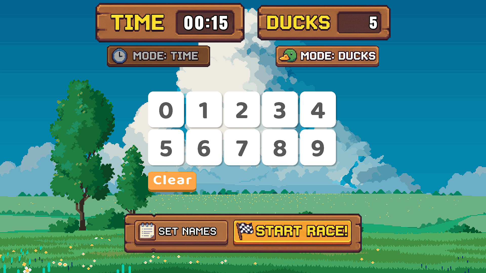
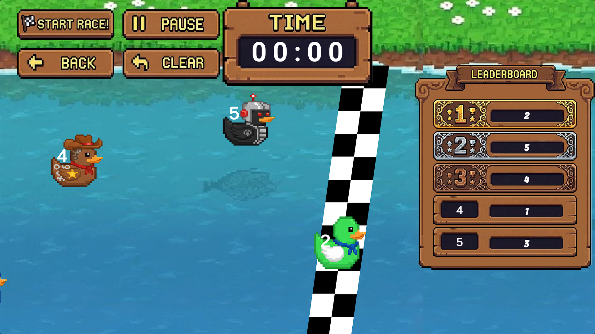

# Duck Race

Duck Race là game đua vịt phong cách "xem và cổ vũ". Người chơi chỉ cần thiết lập thời gian, số lượng vịt hoặc tên; sau đó cuộc đua diễn ra tự động với nhịp độ nhanh, vui và dễ theo dõi. Kết quả hiển thị rõ ràng bằng bảng xếp hạng sau mỗi lượt.

## Điểm nổi bật
- Đua nhanh, dễ chơi lại nhiều lần
- Cấu hình đơn giản: thời gian, số lượng, tên
- Diễn biến có kịch tính (đầu bám, giữa giãn, cuối bứt tốc)
- Giao diện gọn: Setup -> Race -> Leaderboard

## Screenshots

## Tài liệu
- Tổng quan thiết kế: [design/GameDesign.md](design/GameDesign.md)
- Chi tiết cơ chế và ràng buộc: [design/DesignDetails.md](design/DesignDetails.md)
